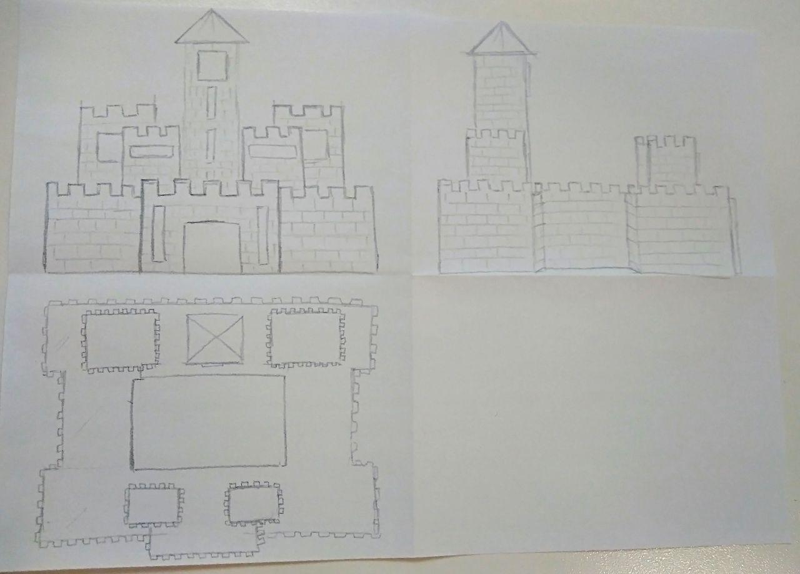

# Modeling and rendering with boxes - Capolingua

## Report

E' stato scelto di realizzare una versione di un castello medievale in stile boxed. I modelli sono stati realizzati tramite il threejs editor usando unicamente cubi ed esportati in GLTF. Il terreno è stato realizzando usando le height map, per ogni pixel della mappa, è stato fatto corrispondere un cubo, che viene scalato e traslato in base alla gradazione di nero del pixel della height map in considerazione, questa è stata realizzanda partendo da quella fornita inizialmente effetuando alcune modifiche in Gimp per creare un fiume e un lago ed adattarla al meglio ai modelli presenti.

Per poter riprodurre correttamente il progetto è necessario eseguirlo in locale. Per farlo ho usato XAMPP. Vedere documentazione THREE.js per ulteriori chiarimenti.

---

## Animazioni

Sono state inserite delle semplici animazioni per rendere più interattivo la scena.
E' possibile aprire e chiudere il cancello d'ingresso del castello
E' possibile animare il cavallo presente all'interno

## Risultato

